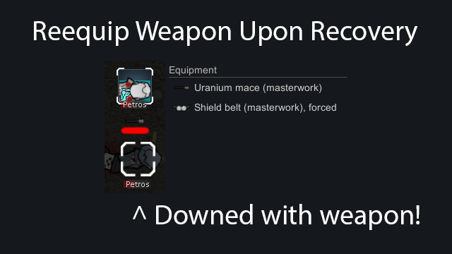

# Reequip Weapon Upon Recovery

Keep weapon (and other inventory stuff for now) when downed and reequip it upon recovery.  

Successor of "Do Not Drop Weapon" and "Where Is My Weapon?" with better implementation.  

Check mod settings.  
There you can find separate options for the player's colonists, enemies, inventory and weapons.  
